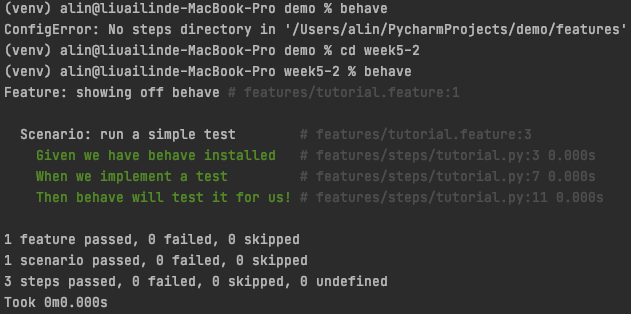

# behave

官方文件：<https://behave.readthedocs.io/en/stable/>

## 安裝

```
pip install behave
```

## 配置

### 最低限制

```
features/
features/everything.feature
features/steps/
features/steps/steps.py
```

### 更複雜的例子

```
features/
features/signup.feature
features/login.feature
features/account_details.feature
features/environment.py
features/steps/
features/steps/website.py
features/steps/utils.py
```

## 完整範例

### feature 範例

`/features/tutorial.feature`

```
Feature: showing off behave

  Scenario: run a simple test
     Given we have behave installed
      When we implement a test
      Then behave will test it for us!
```

### step 範例

`features/steps/tutorial.py`

```py
from behave import *

@given('we have behave installed')
def step_given(context):
    pass

@when('we implement a test')
def step_when(context):
    assert True is not False

@then('behave will test it for us!')
def step_then(context):
    assert context.failed is False
```

- context: 可以用來...

```
Feature: Scenario Outline
 Scenario Outline: Blenders
    Given I put <thing> in a blender
    When I switch the blender on
    Then it should transform into <other thing>
  Examples: Amphibians
    | thing         | other thing |
    | Red Tree Frog | mush        |
    | apples        | apple juice |
  Examples: Consumer Electronics
    | thing         | other thing |
    | iPhone        | toxic waste |
    | Galaxy Nexus  | toxic waste |
```

### 執行

```
behave
behave /features/tutorial.feature
```



### 支援其他語言

```
behave --lang-list
behave --lang-help zh-TW
```

```
Translations for Chinese traditional / 繁體中文
             And: * , 而且, 並且, 同時
      Background: 背景
             But: * , 但是
        Examples: 例子
         Feature: 功能
           Given: * , 假如, 假設, 假定
            Rule: Rule
        Scenario: 場景, 劇本
Scenario Outline: 場景大綱, 劇本大綱
            Then: * , 那麼
            When: * , 當
```

## step 參數

```
# feature
When Enter first name "AILIN" and last name "LIOU"
```

```
@when(u'Enter first name "{first_name}" and last name "{last_name}"')
def step_impl(context, first_name, last_name):
```
