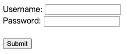

# 表單操作

## text

模擬輸入值到元素中



```html
<form action="/action_page.php">
  <label for="username">Username:</label>
  <input type="text" id="username" name="username" /><br />
  <label for="pwd">Password:</label>
  <input type="password" id="pwd" name="pwd" /><br /><br />
  <input type="submit" value="Submit" />
</form>
```

```py
form_textfield = driver.find_element_by_name('username')
form_textfield.send_keys("admin")
```

## radio

```html
<input type="radio" id="male" name="gender" value="male" />
<label for="male">Male</label><br />
<input type="radio" id="female" name="gender" value="female" />
<label for="female">Female</label><br />
<input type="radio" id="other" name="gender" value="other" />
<label for="other">Other</label>
```

```py
male_radio = driver.find_element_by_css_selector("[for='male']")
male_radio.click()
```

## checkbox

```html
<input type="checkbox" id="vehicle1" name="vehicle1" value="Bike" />
<label for="vehicle1"> I have a bike</label><br />
<input type="checkbox" id="vehicle2" name="vehicle2" value="Car" />
<label for="vehicle2"> I have a car</label><br />
<input type="checkbox" id="vehicle3" name="vehicle3" value="Boat" />
<label for="vehicle3"> I have a boat</label><br />
```

```py
male_radio = driver.find_element_by_css_selector("[for='vehicle1']")
male_radio.click()
```

## textarea

```html
<label for="review">Review:</label>

<textarea id="review" name="review" rows="4" cols="50">
123
</textarea>
```

- <https://www.w3schools.com/tags/tag_textarea.asp>

```py
textarea = driver.find_element_by_name('review')
textarea.send_keys("demo")
```

## submit

模擬 submit 行為

```py
driver.find_element_by_id("submit").click()
element.submit()
```

## 上傳檔案

```python
picture = driver.find_element_by_css_selector("[type='file']")
picture.send_keys('/demo/screenshot.png')
```

<!-- ## select

```py
from selenium.webdriver.support.ui import Select
select = Select(driver.find_element_by_name('name'))
select.select_by_index(index)
select.select_by_visible_text("text")
select.select_by_value(value)
```

```
options = select.options
```

```py
select = Select(driver.find_element_by_id('id'))
select.deselect_all()
``` -->

### 參考文獻

- [Selenium File Upload](https://saucelabs.com/resources/articles/best-practices-tips-selenium-file-upload)
