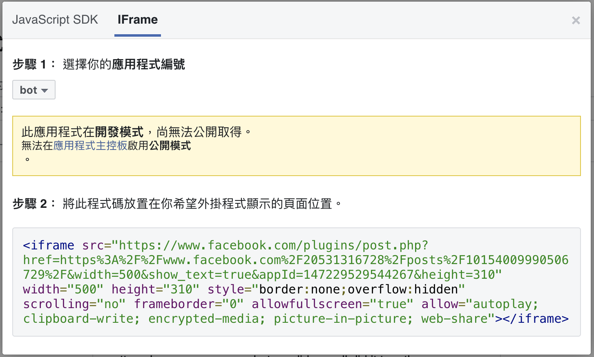

# IFrame

- `<iframe>` 標籤用來定義 inline frame，一個 inline frame 嵌入在當前的頁面裡。
- <https://www.w3schools.com/tags/tag_iframe.ASP>

## 常見使用情境

- 頁面內含外部套件，如下：

  - 社交外掛程式：<https://developers.facebook.com/docs/plugins/embedded-posts/>
  - editor
  - map

  
  

## 切換 Iframe

語法ㄧ：透過 ID

```html
<iframe id="ifr" name="demo" src="demo.html" height="200" width="300"></iframe>
```

```py
driver.switch_to_frame("ifr")
```

語法二：透過 Name

```html
<iframe id="ifr" name="demo" src="demo.html" height="200" width="300"></iframe>
```

```py
driver.switch_to_frame("demo")
```

語法三：透過 index

```
<iframe id="ifr" name="demo" src="demo.html" height="200" width="300"></iframe>
<iframe id="ifr" name="demo" class='second' src="width.html" height="200" width="300"></iframe>
<iframe id="ifr" name="demo" src="width.html" height="200" width="300"></iframe>
```

```py
driver.switch_to_frame(1)
```

語法四：透過元素

```py
iframe = driver.find_element_by_css_selector('iframe')
driver.switch_to.frame(iframe)
```

## 回到預設頁面區塊

```
driver.switch_to.default_content()
```

## 延伸閱讀

- [Select iframe using Python and Selenium](https://www.tutorialspoint.com/select-iframe-using-python-and-selenium)
