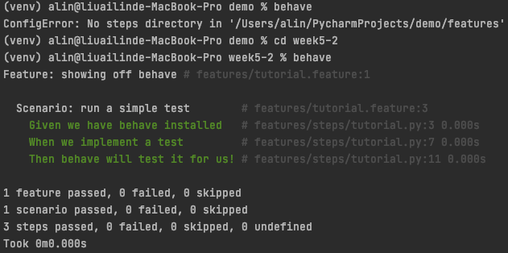

# 活文件 (living document)

- 所謂的活文件 Living Document 意思是說，文件的會隨著時間、處境而跟著改變的。
- 在軟體上；一份活的文件或動態文件就是一份不斷修改和更新的文件。

### 支援活文件的框架

- behave: <https://behave.readthedocs.io/en/stable/>
- cucumber: <https://cucumber.io/>
- ...

## Given When Then

每個 scenario 可以分為三個部分：

- Given: 測試的前置條件
- When: 執行某些操作
- Then: 預期的行為


## behave

```
pip install behave
pip install behave2cucumber
```

<!-- ```
behave --lang-list
behave --lang-help zh-TW
``` -->

`/features/tutorial.feature`

```
Feature: showing off behave

  Scenario: run a simple test
     Given we have behave installed
      When we implement a test
      Then behave will test it for us!
```

`features/steps/tutorial.py`

```py
from behave import *

@given('we have behave installed')
def step_given(context):
    pass

@when('we implement a test')
def step_when(context):
    assert True is not False

@then('behave will test it for us!')
def step_then(context):
    assert context.failed is False
```



## 延伸閱讀

- [GivenWhenThen | Martin Fowler](https://martinfowler.com/bliki/GivenWhenThen.html)
- <https://www.youtube.com/results?search_query=python+cucumber>
- [行为驱动开发：一篇文章带你用 Python 玩转 BDD](https://www.jianshu.com/p/196a540dc35b)
- <https://www.tenlong.com.tw/products/9789862019481>


