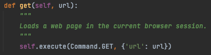

# 導航 (Navigate to)

一些基本的常用瀏覽器操作

## get

模擬瀏覽器載入指定網頁

```py
driver.get("https://selenium.dev")
```



<!-- 說明怎麼看 API 文件和 source code -->

## current_url

取得當前的 URL

```py
driver.current_url
```

### 使用情境

- 考慮到驗證 title 會遇到多國語系的問題

## back

返回上一頁

```py
driver.back()
```

## forward

模擬按下瀏覽器下一頁的按鈕

```py
driver.forward()
```

## refresh

模擬按下瀏覽器重新整理的按鈕

```py
driver.refresh()
```

### 使用情境

- 想要一次重新整理整頁，而不是局部。

## title

取得 title 值

```py
driver.title
```

## 練習題

- 將 clear 改用 refresh 替代
