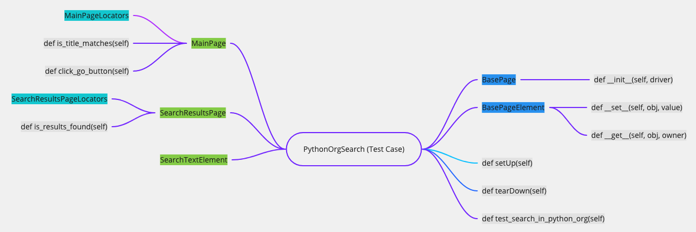

# POM (Page Object Model)

POM (Page Object Model) 是一種設計模式，好處有：

- 易於閱讀的測試案例
- 建立在多個測試案例之間共享，且可重複使用的程式碼。
- 減少重複程式碼的數量
- 如果 UI 發生改變，則僅需在一個位置進行更改程式碼。

> 設計模式（design pattern）: 在軟體工程中，設計模式是對軟體設計中普遍存在的各種問題，所提出的解決方案。

### 設計思維

1. 然後再想測試步驟
1. 然後想要切分成幾個 Page
1. 最後在抽出 element 跟 locators 的細節

## 測試案例 (Test case)



這是一個測試案例，是執行測試的進入點，它在 Python 官網上搜尋一個關鍵字，並取得搜尋結果。

```py
# demo.py
import unittest
from selenium import webdriver
import page

class PythonOrgSearch(unittest.TestCase):

    def setUp(self):
        self.driver = webdriver.Chrome("../chromedriver")
        self.driver.get("http://www.python.org")

    def test_search_in_python_org(self):
        main_page = page.MainPage(self.driver)
        assert main_page.is_title_matches(), "python.org title doesn't match."
        main_page.search_text_element = "pycon"
        main_page.click_go_button()
        search_results_page = page.SearchResultsPage(self.driver)
        assert search_results_page.is_results_found(), "No results found."

    def tearDown(self):
        self.driver.close()

if __name__ == "__main__":
    unittest.main()
```

### 頁面物件類別 (Page Object Class)

```py
# page.py
from element import BasePageElement
from locators import MainPageLocators

class SearchTextElement(BasePageElement):
    locator = 'q'

class BasePage(object):
    def __init__(self, driver):
        self.driver = driver


class MainPage(BasePage):
    search_text_element = SearchTextElement()

    def is_title_matches(self):
        return "Python" in self.driver.title

    def click_go_button(self):
        element = self.driver.find_element(*MainPageLocators.GO_BUTTON)
        element.click()


class SearchResultsPage(BasePage):
    def is_results_found(self):
        return "No results found." not in self.driver.page_source
```

## 頁面元素

```py
# element.py
from selenium.webdriver.support.ui import WebDriverWait


class BasePageElement(object):

    def __set__(self, obj, value):
        driver = obj.driver
        WebDriverWait(driver, 100).until(
            lambda driver: driver.find_element_by_name(self.locator))
        driver.find_element_by_name(self.locator).clear()
        driver.find_element_by_name(self.locator).send_keys(value)

    def __get__(self, obj, owner):
        driver = obj.driver
        WebDriverWait(driver, 100).until(
            lambda driver: driver.find_element_by_name(self.locator))
        element = driver.find_element_by_name(self.locator)
        return element.get_attribute("value")
```

## 定位 (Locators)

```py
# locators.py
from selenium.webdriver.common.by import By

class MainPageLocators(object):
    GO_BUTTON = (By.ID, 'submit')

class SearchResultsPageLocators(object):
    pass

```

#### 參考文獻

- [6. Page Objects](https://selenium-python.readthedocs.io/page-objects.html#)
