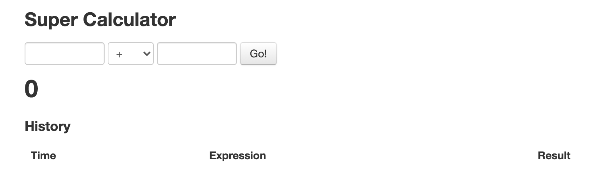

# 練習題：測試計算機



### 解答

```python
# 1. import 要使用的類別
from selenium import webdriver
from selenium.webdriver.common.keys import Keys

# 2. 建立模擬人的行為的瀏覽器的物件
driver = webdriver.Chrome("./chromedriver.exe")

# 3. 前往特定的網址
driver.get("http://juliemr.github.io/protractor-demo/")

# 4. 驗證是不是在對的頁面
assert "Super Calculator" in driver.title

# 5. 選取元素
input1 = driver.find_element_by_css_selector("[ng-model='first']")
input2 = driver.find_element_by_css_selector("[ng-model='second']")
button = driver.find_element_by_id("gobutton")

# 6. 控制元素行為
input1.send_keys("1")
input2.send_keys("2")
button.send_keys(Keys.ENTER)

# 7. 關閉視窗
driver.quit()
```
