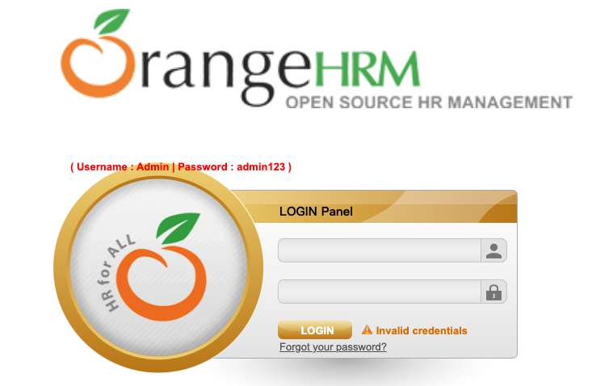
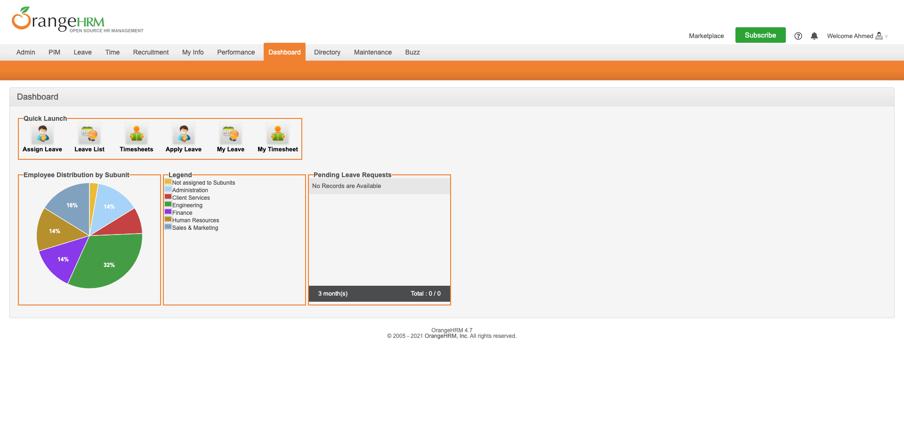

# 練習題：登入練習

## 1. 透過自動化執行登入動作

複習 find_element 跟 send_keys 語法，並練習到新教的 submit 語法。

<https://opensource-demo.orangehrmlive.com/>



### 解答

## 2. 擷取一張登入後最大化視窗的截圖



### 練習目標

- 最大化視窗
- 截圖語法

### 解答

````py
from selenium import webdriver

driver = webdriver.Chrome("./chromedriver")
driver.get("https://opensource-demo.orangehrmlive.com/")
assert "OrangeHRM" in driver.title

# 最大化視窗
driver.maximize_window()

try:
    user_name = driver.find_element_by_css_selector("#txtUsername")
    user_name.send_keys("Admin")

    user_email = driver.find_element_by_css_selector("#txtPassword")
    user_email.send_keys("admin123")

    login_button = driver.find_element_by_css_selector("#btnLogin")
    login_button.submit()

    # 截圖存檔
    driver.save_screenshot('screenshot.png')
finally:
    driver.quit()
```
````
