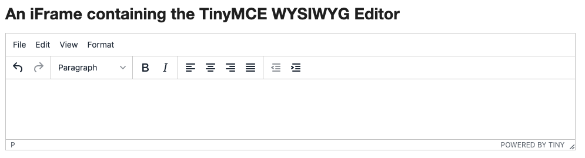

# 練習題：TinyMCE



- <http://the-internet.herokuapp.com/iframe>
  - driver.switch_to.frame(iframe)
  - driver.switch_to.default_content()

<!-- ### 答案

```py
from selenium import webdriver
from time import sleep

driver = webdriver.Chrome("./chromedriver")
driver.get("http://the-internet.herokuapp.com/iframe")
assert "The Internet" in driver.title

try:
    iframe = driver.find_element_by_css_selector('iframe')
    driver.switch_to.frame(iframe)
    editor = driver.find_element_by_css_selector('body')
    editor.clear()
    editor.send_keys("123")
    # sleep(5)
    driver.switch_to.default_content()
    title = driver.find_element_by_css_selector('h3')
    assert "An iFrame containing the TinyMCE WYSIWYG Editor" in title.text
finally:
    driver.quit()

``` -->
