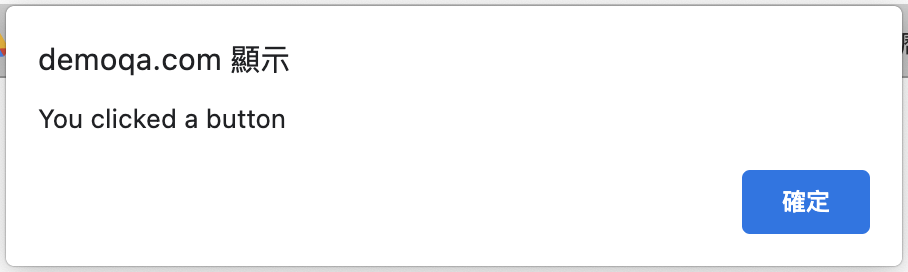
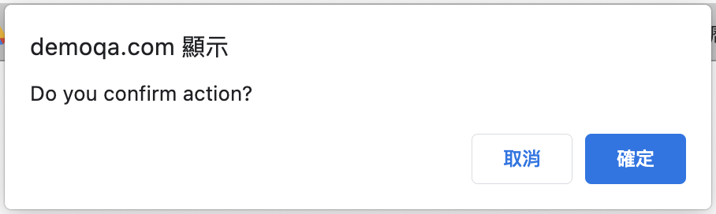
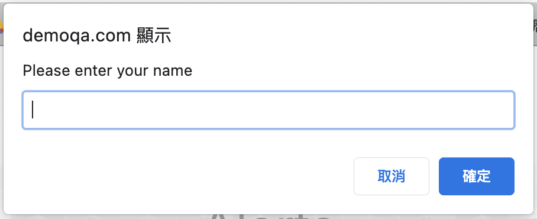

# 練習題：訊息框

- <https://demoqa.com/alerts>

## 警告訊息框 (alert)



- 會用到的語法
  - switch_to.alert
  - expected_conditions.alert_is_present()
  - alert.text
  - alert.accept()

## 確認訊息框 (confirm)



- 會用到的語法
  - driver.switch_to.alert
  - alert.accept()
  - alert.dismiss()

## 提示訊息對話 (prompt)



- 會用到的語法
  - driver.switch_to.alert
  - alert.send_keys("AILIN LIOU")

### 答案

```py
from selenium import webdriver
from selenium.webdriver.support.ui import WebDriverWait
from selenium.webdriver.support import expected_conditions

driver = webdriver.Chrome("./chromedriver")
driver.get("https://demoqa.com/alerts")
assert "ToolsQA" in driver.title

driver.maximize_window()

try:
    driver.find_element_by_id("alertButton").click()
    alert = driver.switch_to.alert
    text = alert.text
    print(text)
    alert.accept()

    driver.find_element_by_id("timerAlertButton").click()
    alert2 = WebDriverWait(driver, 6).until(expected_conditions.alert_is_present())
    text2 = alert.text
    print(text2)
    alert2.accept()

finally:
    driver.quit()
```

## 練習題：確認訊息框

```py
from selenium import webdriver

driver = webdriver.Chrome("./chromedriver")
driver.get("https://demoqa.com/alerts")
assert "ToolsQA" in driver.title

try:
    driver.find_element_by_id('confirmButton').click()
    alert = driver.switch_to.alert
    print(alert.text)
    alert.accept()
    # alert.dismiss()
finally:
    driver.quit()
```

## 練習題：提示訊息對話

```py
from selenium import webdriver

driver = webdriver.Chrome("./chromedriver")
driver.get("https://demoqa.com/alerts")
assert "ToolsQA" in driver.title

try:
    driver.find_element_by_id('promtButton').click()
    alert = driver.switch_to.alert
    alert.send_keys("AILIN LIOU")
    print(alert.text)
    alert.accept()
finally:
    driver.quit()
```
