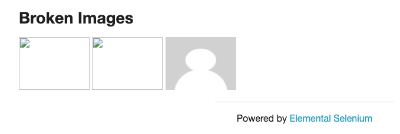

# 練習題：檢查是否有損壞的圖片



- <http://the-internet.herokuapp.com/broken_images>
- 會用到的語法
  - current_url()
  - element.get_attribute("attr_name")
  - requests.get(url)
  - response.status_code

<!-- ### 解答

```py
from selenium import webdriver
import requests
from time import sleep

driver = webdriver.Chrome("./chromedriver")
driver.get("http://the-internet.herokuapp.com/broken_images")

try:
    base_url = driver.current_url
    images = driver.find_elements_by_css_selector("img")
    for img in images:
        response = requests.get(img.get_attribute('src'))
        if response.status_code != 200:
            print(img.get_attribute('outerHTML') + " is broken.")
        else:
            print(img.get_attribute('outerHTML') + " is unbroken.")
    sleep(5)
finally:
    driver.quit()
```

-->
