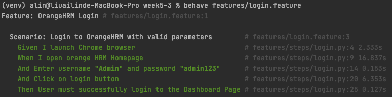

# 練習題：登入

## Step1

1. 建立 `features/` 和 `features/steps/` 資料夾
1. 建立 feature 檔案，例如 `login.feature`。
1. 執行 `behave`



```
Feature: OrangeHRM Login

  Scenario: Login to OrangeHRM with valid parameters
    Given I launch Chrome browser
    When I open orange HRM Homepage
    And Enter username "admin" and password "admin123"
    And Click on login button
    Then User must successfully login to the Dashboard Page
```

## Step2

1. 建立 step 檔案，例如 `features/steps/login.py`。
1. 添加 `behave` 和 `selenium` 模組

## Step3

1. 實作 `login.py` 細節
1. 執行 `behave`
