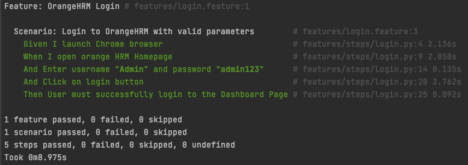
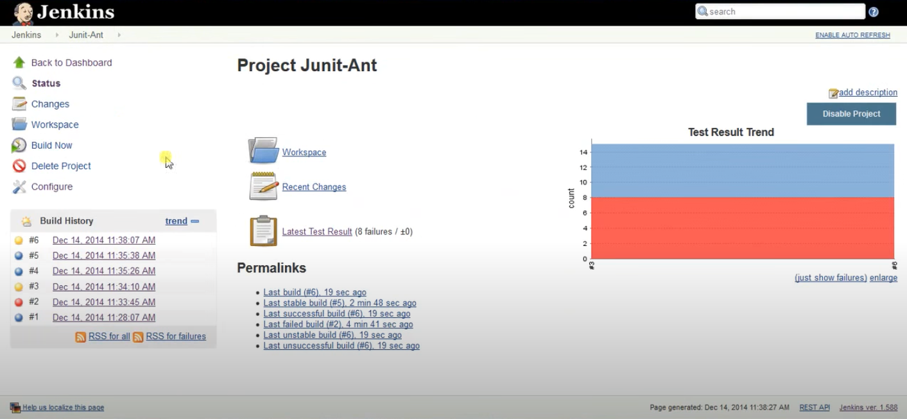
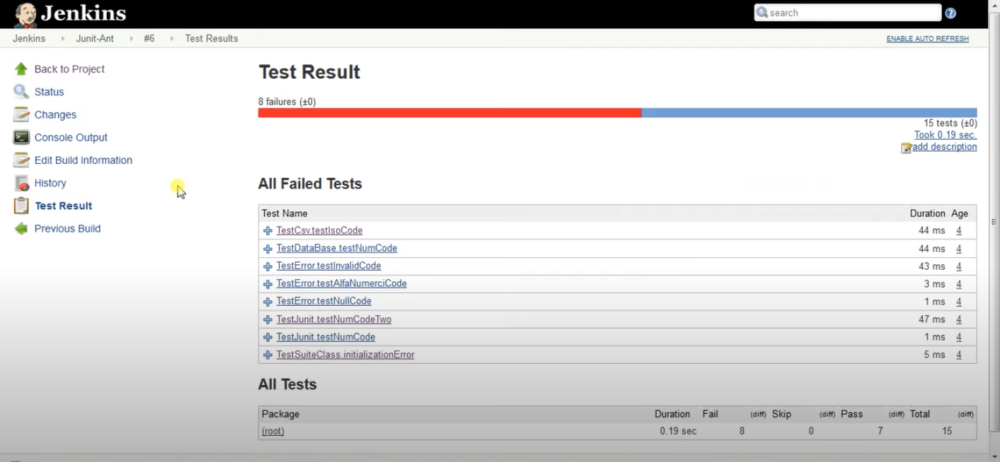
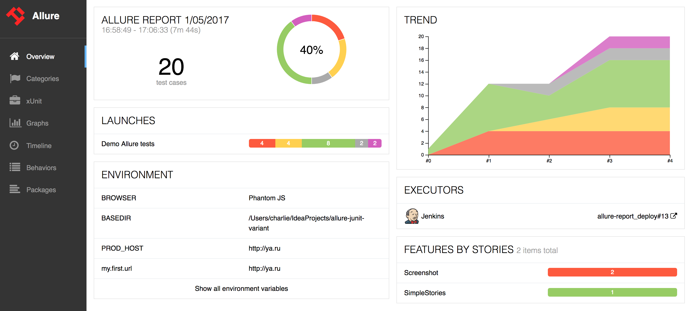

# 報表

可輸出的格式

```
behave -f help
```

```
Available formatters:
  json           JSON dump of test run
  json.pretty    JSON dump of test run (human readable)
  null           Provides formatter that does not output anything.
  plain          Very basic formatter with maximum compatibility
  pretty         Standard colourised pretty formatter
  progress       Shows dotted progress for each executed scenario.
  progress2      Shows dotted progress for each executed step.
  progress3      Shows detailed progress for each step of a scenario.
  rerun          Emits scenario file locations of failing scenarios
  sphinx.steps   Generate sphinx-based documentation for step definitions.
  steps          Shows step definitions (step implementations).
  steps.catalog  Shows non-technical documentation for step definitions.
  steps.doc      Shows documentation for step definitions.
  steps.usage    Shows how step definitions are used by steps.
  tags           Shows tags (and how often they are used).
  tags.location  Shows tags and the location where they are used.

```

## pretty 報表

```
behave -f pretty
```



## Junit 報表

```
behave --junit
```

會產生一個 xml 檔





## Allure 報表

執行以下指令會產生一個 json 格式的檔案

```
behave -f allure_behave.formatter:AllureFormatter -o allure_data
```

在 MAC 上安裝 Allure

```
brew tap qameta/allure
brew install allure
```



### 參考文獻

- <https://github.com/behave/behave>
- <https://docs.qameta.io/allure/#_installing_a_commandline>
- <https://docs.qameta.io/allure/#_behave>

## 補充：通知

除此之外，產出報表通常也會一併發送測試的通知結果。可以透過 CI 工具，例如 [Jenkins](https://www.jenkins.io/) 來達到排程執行和發送通知結果。
