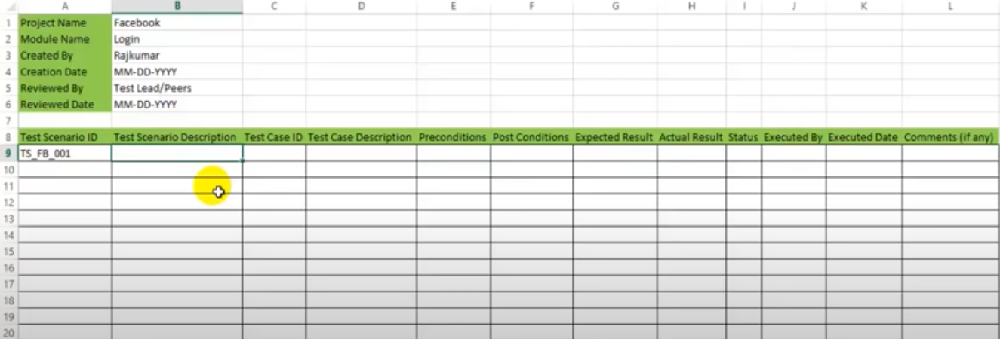
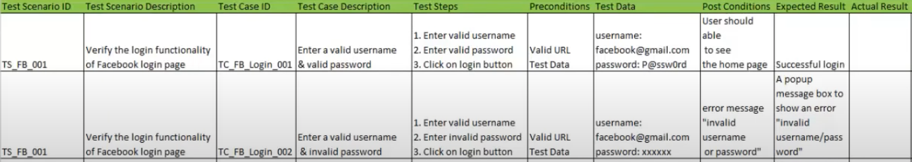

# 測試計畫

## 格式

## 測試計畫資訊

- 專案名稱 (Project Name)
- 模組名稱 (Module Name)
- 建立的人 (Created By)
- 建立的日期 (Created Date)
- 審閱者 (Reviewed By)
- 審閱日期 (Reviewed Date)

## 測試案例 (Test Case) 的詳細資訊

- Test Scenario ID
- Test Scenario 描述
- Test Case Id
- Test Case 描述
- 前置條件
- 後製條件
- 預期結果
- 實際結果
- 狀態
- 執行者
- 執行日期
- 備註

### Test Case 和 Test Scenario 的差異

假設以電子書平台為例，你可能會有以下的 Test Scenario。

- Test Scenario 1: 透過關鍵字，搜尋到符合條件的電子書。
- Test Scenario 2: 找到喜歡的電子書之後，可以加入購物車。

而 Test Scenario 1 又可以再細分

- Test Case 1: 可以針對作者名稱搜尋
- Test Case 2: 可以針對書名搜尋
- Test Case 3: 可以針對出版社名稱搜尋

所以 Test Case 是針對執行特定方法來驗證操作的正確性，Test Scenario 則是針對要測試什麼樣的需求功能(比較從業務面去考量)，一個 Test Scenario 可以包含一組的 Test Case。

### 範例

## 參考文獻

- [How To Write TEST CASES In Manual Testing | Software Testing - YouTube](https://www.youtube.com/watch?v=g0PrXoWKM2Y)
- [Test Case vs Test Scenario: What's the Difference? | Guru99](https://www.guru99.com/test-case-vs-test-scenario.html)
