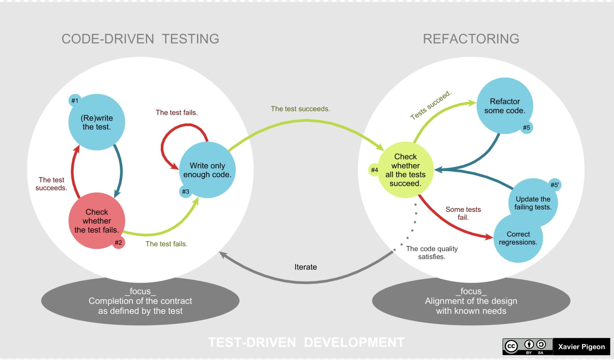

# 常見開發流程

## TDD

- TDD（Test-Driven Development）是一種開發流程，中文是「測試驅動開發」。
- 用一句白話形容，就是「先寫測試再開發」。
- 先寫測試除了能確保測試程式的撰寫，且有助於在開發初期釐清程式介面，如何設計。

### 具體來說，TDD 流程可以分成五個步驟

1. 選定一個功能，新增測試案例
1. 執行測試，得到 Failed（紅燈）
1. 實作「夠用」的產品程式
1. 再次執行測試，得到 Passed（綠燈)
1. 重構程式

### 參考文獻

- [TDD 開發五步驟，帶你實戰 Test | Alpha Camp](https://tw.alphacamp.co/blog/tdd-test-driven-development-example)

## BDD

### 為什麼需要 BDD？

- TDD 是一種軟體開發流程，先測試再開發。
- TDD 所實作的測試程式碼，可以作為工程師之間討論測試案例或使用情境的基礎
  - 但是對非開發人員很難透過程式碼，去理解測試案例，也更難根據測試案例，進一步討論軟體的功能。

### 什麼是 BDD？

- TDD 是實作前先寫測試，BDD 比 TDD 更進一步在寫測試前，還要先寫測試規格。
- 這份測試規格會用更接近人類語意的方式描述軟體功能和測試案例
- 這份規格並不是單純的敘述軟體的功能，而是一份「可以被執行的規格」，也就是可以被轉成自動化測試。
- BDD 框架皆支援 Gherkin 語法，這是一種簡單易懂的語言，使用關鍵字來定義系統特徵和測試。

### BDD 常見的熱門框架

- behave: <https://behave.readthedocs.io/en/stable/>
- cucumber: <https://cucumber.io/>
- ...
