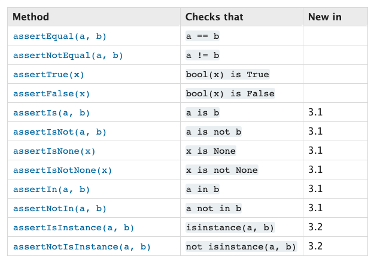

# 測試框架

目前 Python 常見的測試框架主要是 [unittest](http://pyunit.sourceforge.net/pyunit.html) 和 [pytest](http://pytest.org/en/latest/)，在此我們使用 unittest 作為範例。

> unittest 又名 PyUnit

unittest 支持物件導向的一些重要的概念，如下所示：

- test fixture：它代表跟測試相關所有的資料或程序，例如建立臨時的測試資料庫或建立一些假的測試用資料。
  A test fixture represents the preparation needed to perform one or more tests, and any associated cleanup actions. This may involve, for example, creating temporary or proxy databases, directories, or starting a server process.
- test case：中文常翻譯為「測試案例」，test case 是一個獨立的測試單元。它會針對特定的輸入跟輸出做檢查。unittest 提供叫 `TestCase` 的基礎的類別，可被使用來建立新的 test case。
- test suite：中文常翻譯為「測試套件」，一個 test suite 裡可以包含多個 test case，讓這些測試可以一起執行。
- test runner：test runner 是一個會自動執行測試案例，並產出測試結果的元件，測試結果可以是用文字呈現，也可以用圖形化呈現。

英文：<https://docs.python.org/3/library/unittest.html>
中文：<https://docs.python.org/zh-tw/3/library/unittest.html>

## 乘除模組

```py
# calc.py
def add(x, y):
    return x + y

def subtract(x, y):
    return x - y

def multiply(x, y):
    return x * y

def divide(x, y):
    if y == 0:
        raise ValueError('Can not divide by zero!')
    return x / y
```

### 測試程式

```py
# test_calc.py
import unittest
import calc

class TestCalc(unittest.TestCase):

    def test_add(self):
        self.assertEqual(calc.add(10, 5), 15)
        self.assertEqual(calc.add(-1, 1), 0)
        self.assertEqual(calc.add(-1, -1), -2)

    def test_subtract(self):
        self.assertEqual(calc.subtract(10, 5), 5)
        self.assertEqual(calc.subtract(-1, 1), -2)
        self.assertEqual(calc.subtract(-1, -1), 0)

    def test_multiply(self):
        self.assertEqual(calc.multiply(10, 5), 50)
        self.assertEqual(calc.multiply(-1, 1), -1)
        self.assertEqual(calc.multiply(-1, -1), 1)

    def test_divide(self):
        self.assertEqual(calc.divide(10, 5), 2)
        self.assertEqual(calc.divide(-1, 1), -1)
        self.assertEqual(calc.divide(-1, -1), 1)
        self.assertEqual(calc.divide(5, 2), 2.5)

        with self.assertRaises(ValueError):
            calc.divide(10, 0)


if __name__ == '__main__':
    unittest.main()
```

testcase 可以透過繼承 `TestCase` 類別來建立，這裡定義了四個獨立的物件方法，名稱皆以 test 開頭，這樣的命名方式能告知 test runner 哪些物件方法為定義的測試。

而每個測試可呼叫 `assertEqual()` 來確認是否為期望的結果，`assertTrue()` 或是 `assertFalse()` 用來驗證一個條件式，`assertRaises()` 則是用來驗證是否觸發一個特定的 exception。使用 assert 相關語法，將能使 test runner 收集所有的測試結果，並產生一個測試報表。

除此之外，透過 `setUp()` 和 `tearDown()` 方法，可以設定測試開始前或結束時要執行的程序。最後可透過執行 `unittest.main()` 方法，來執行測試腳本。

如果執行 `python test_calc.py`，輸出結果如下：

```
....
----------------------------------------------------------------------
Ran 4 tests in 0.001s

OK
```

透過 v 參數，你可以得到更多的測試結果細節，例如 `python -m unittest -v test_calc.py`，輸出結果如下：

```
test_add (test_calc.TestCalc) ... ok
test_divide (test_calc.TestCalc) ... ok
test_multiply (test_calc.TestCalc) ... ok
test_subtract (test_calc.TestCalc) ... ok

----------------------------------------------------------------------
Ran 4 tests in 0.000s

OK
```

如果要個別執行測試，則可以使用類似下面的語法。

```
python -m unittest test_module1 test_module2
python -m unittest test_module.TestClass
python -m unittest test_module.TestClass.test_method
```

## Assert 語法



## 結合 selenium 的完整範例

```python
import unittest
from selenium import webdriver
from selenium.webdriver.common.keys import Keys

class PythonOrgSearch(unittest.TestCase):

    def setUp(self):
        self.driver = webdriver.Chrome("./chromedriver")

    def test_search_in_python_org(self):
        driver = self.driver
        driver.get("http://www.python.org")
        self.assertIn("Python", driver.title)
        elem = driver.find_element_by_name("q")
        elem.send_keys("pycon")
        elem.send_keys(Keys.RETURN)
        assert "No results found." not in driver.page_source

    def tearDown(self):
        self.driver.close()

if __name__ == "__main__":
    unittest.main()
```

輸出的結果

```python
python test_python_org_search.py
.
----------------------------------------------------------------------
Ran 1 test in 15.566s

OK
```
